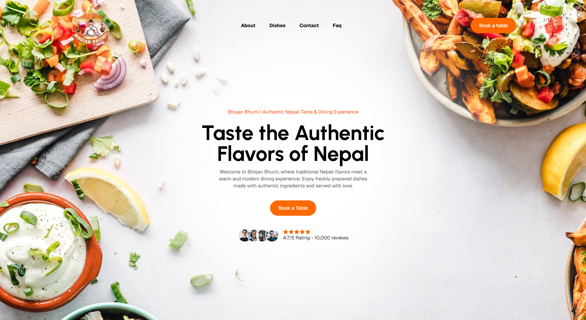

# 🍽️ Bhojan Bhumi

Bhojan Bhumi is a modern and responsive restaurant website built using **React.js and Tailwind CSS**. It provides an attractive interface where users can explore dishes, special offers, restaurant information, opening hours, customer reviews, FAQs, and the table booking process.

The project focuses on **reusable components, responsive design, smooth scrolling, and modern animations**.

## 🚀 Technologies & Packages

* **React.js** - Building the user interface
* **React DOM** - Rendering React components
* **Tailwind CSS** - Styling and responsive design
* **Motion** - Animations and interactive effects
* **Lenis** - Smooth scrolling
* **Lucide React** - Modern icons

## 📌 Website Sections

* **Hero Section** - Introduction and main call-to-action
* **About** - Information about Bhojan Bhumi
* **Stats** - Customer, dishes, and rating statistics
* **Dishes** - Popular and signature dishes
* **Features** - Restaurant features and benefits
* **Booking Process** - Three-step table reservation process
* **Special Offers** - Food offers and deals
* **Opening Hours** - Restaurant operating hours
* **Customer Reviews** - Customer feedback and ratings
* **FAQ** - Frequently asked questions
* **CTA** - Call-to-action for booking and menu exploration

## 🧩 Components

### Animated

Reusable component for scroll-based entrance animations.

### Navbar

Contains the main navigation and links to different sections of the website.

### Footer

Contains restaurant information, navigation links, contact details, social links, and copyright information.

## 📁 Project Structure

```text
src/
│
├── components/
│   ├── Animated.jsx
│   ├── Navbar.jsx
│   └── Footer.jsx
│
├── sections/
│   ├── HeroSection.jsx
│   ├── About.jsx
│   ├── Stats.jsx
│   ├── Dishes.jsx
│   ├── Feature.jsx
│   ├── BookingProcess.jsx
│   ├── SpecialOffer.jsx
│   ├── OpeningHours.jsx
│   ├── CustomerReview.jsx
│   ├── FAQ.jsx
│   └── CTA.jsx
│
├── data/
│   └── data.js
│
├── App.jsx
├── main.jsx
└── index.css
```

## ⚙️ Installation

Clone the repository:

```bash
git clone <your-repository-url>
```

Move into the project directory:

```bash
cd bhojan-bhumi
```

Install dependencies:

```bash
npm install
```

Start the development server:

```bash
npm run dev
```

Open the local URL provided by Vite in your browser.

## ✨ Key Features

* Responsive restaurant website
* Modern and clean UI
* Reusable React components
* Tailwind CSS styling
* Smooth scrolling with Lenis
* Scroll animations with Motion
* Lucide icons
* Interactive hover effects
* Food and offer cards
* Booking process
* Customer reviews
* FAQ section
* Mobile-friendly design

## 🔮 Future Improvements

* Online food ordering
* Shopping cart
* User authentication
* Online payment
* Node.js and Express backend
* MongoDB database
* Restaurant admin dashboard
* Online reservation management

## 👨‍💻 Author

**Prashis Pudasaini**

BIM Student | Frontend & MERN Stack Learner

---

### 🍽️ Bhojan Bhumi

**Authentic Taste. Memorable Moments.**

## Preview



